# SahamFYP — AI Market Brief & Anti-FOMO Watchlist for Gen Z Investors

[](https://react.dev/)
[](https://typescriptlang.org/)
[](https://vitejs.dev/)
[](https://tailwindcss.com/)
[](https://n8n.io/)
[](https://sectors.app/)
[](https://www.browserless.io/)
[-orange)](https://sumopod.com/)
[](https://supabase.com/)
[](https://opensource.org/licenses/MIT)

> **"Make Market Data Make Sense."** — Mentransformasi riset pasar sekuritas dan keterbukaan informasi yang tebal menjadi visual watchlist harian berbasis Sectors API, lengkap dengan bedah katalis dan sistem peringatan risiko (warning) objektif untuk investor Gen Z.

---

## 🏆 Sectors Hackathon 2026

<p align="center">
  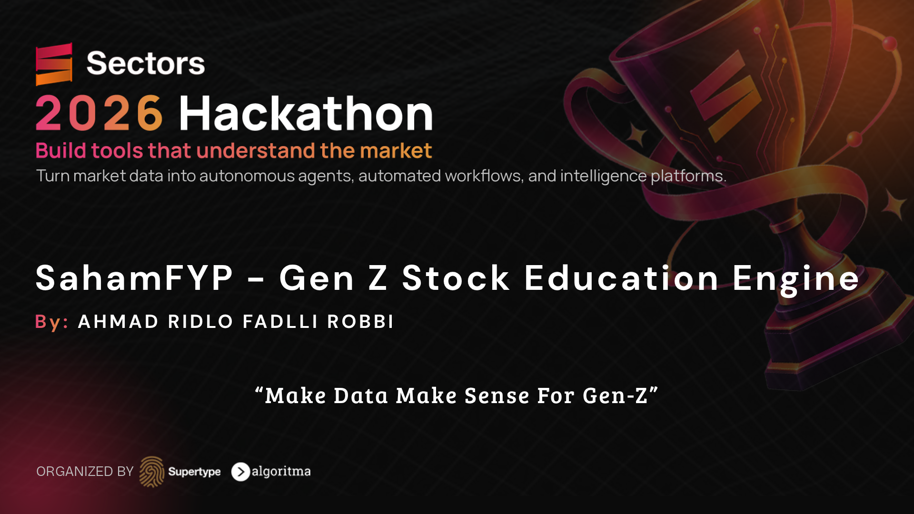
</p>

| | |
|---|---|
| **Track** | Automation & Workflows |
| **One-Sentence Problem Statement** | **54,4% investor pasar modal Indonesia adalah Gen Z, namun banyak dari mereka FOMO mengikuti rekomendasi saham viral dari media sosial dan grup pom-pom, alih-alih mengecek data riil perusahaan — SahamFYP hadir dengan daily market brief berbasis data Sectors API, lengkap informasi dan warning risiko, dipublikasikan langsung di media sosial: kanal tempatnya para Gen Z.** |
| **Who it's for** | **End-User: Gen Z & Retail Investors** (yang butuh panduan pasar kredibel tapi ringan dicerna), serta **Financial Educators / Sekuritas** (yang butuh pipeline otomatis untuk menjangkau investor muda tanpa kehilangan akurasi data). |
| **Core Innovation** | **Anti-FOMO Reality Check Engine**: Bukan sekadar ikut-ikutan tren viral, AI membedah 3W (*What, Why, Impact*) dari berita/filings, lalu memvalidasinya dengan data fundamental & teknikal Sectors API. Jika saham sedang ramai dibicarakan tapi fundamentalnya boncos atau utangnya bengkak, SahamFYP memberikan **Warning & Red Flag** secara transparan. |
| **Live Proof** | Akun publik **[@sahamfyp.id](https://instagram.com/sahamfyp.id)** berjalan 100% otomatis (unattended) di Instagram, TikTok, Threads, Facebook, dan Telegram Channel — [contoh postingan live](https://www.instagram.com/p/Dda3y6UiQwy/). |
| **Live Dashboard** | **[saham-fyp.vercel.app](https://saham-fyp.vercel.app/)** (Vercel Hosting + Supabase Backend/Auth). Akun Demo: `demo@sahamfyp.id` / `d3m0cu4n` |

> **Catatan penting soal core data source**: SahamFYP menggunakan **Sectors REST API** di setiap tahap alur — deteksi ticker, enrichment laporan keuangan & valuasi, ranking top movers berkapitalisasi wajar, hingga foreign flow dan kalkulasi teknikal Moving Average. **Kalau data Sectors.app dicabut, produk ini kehilangan fungsi intinya**: slide 4–6 di semua template konten bergantung penuh pada data tersebut untuk verifikasi faktual. Tanpa Sectors API, sistem hanya jadi rewrite berita tanpa nilai tambah — persis kebalikan dari misi produk ini.

---

## 📑 Daftar Isi
- [📌 Apa Itu SahamFYP?](#-apa-itu-sahamfyp)
- [🎯 Latar Belakang & Masalah Gen Z](#-latar-belakang--masalah-gen-z)
- [🌟 Fitur Utama](#-fitur-utama)
- [🖥️ Dashboard Monitoring & Live Demo](#️-dashboard-monitoring--live-demo)
- [🛠️ Tech Stack](#️-tech-stack)
- [📑 Template Konten Postingan](#-template-konten-postingan)
- [📦 Cara Duplikasi / Clone Content Engine](#-cara-duplikasi--clone-content-engine)
- [📁 Struktur Project](#-struktur-project)
- [🔌 API Reference](#-api-reference)
- [🔗 Quick Links & Resources](#-quick-links--resources)
- [🔧 Troubleshooting](#-troubleshooting)
- [📝 Catatan Versi](#-catatan-versi)
- [📊 Data Pendukung](#-data-pendukung-latar-belakang-gen-z-investor)

---

## 📌 Apa Itu SahamFYP?

<p align="center">
  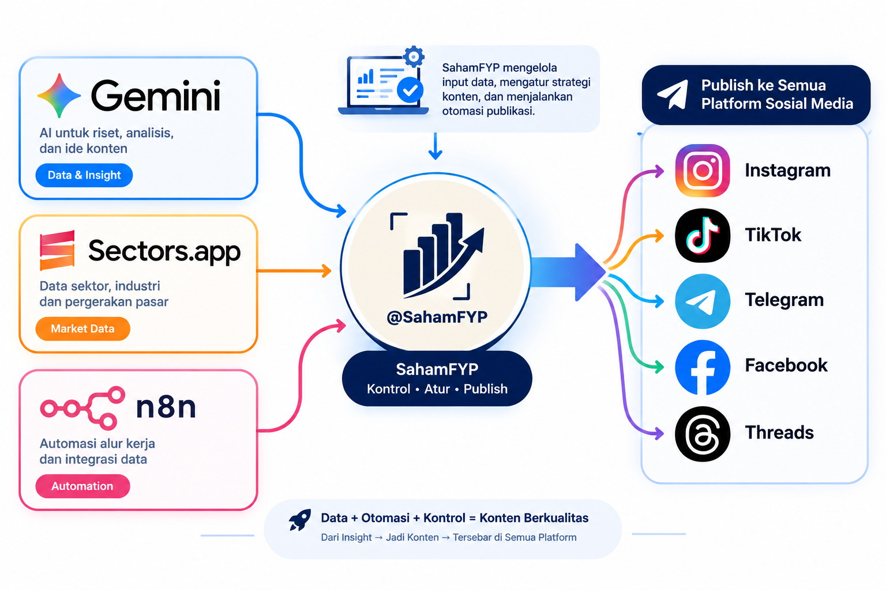
</p>

**SahamFYP** adalah **AI-Powered Market Brief & Risk Warning Engine** yang didesain khusus untuk melindungi dan mengedukasi investor generasi baru (Gen Z).

Setiap hari sebelum bursa saham Indonesia buka (08:00 WIB), SahamFYP memproses data pasar modal secara otonom:
1. **Kurasi Berita & Filings Terhangat**: Mengumpulkan keterbukaan informasi BEI dan berita pasar dari 8 sumber ekonomi terpercaya.
2. **Ekstraksi Katalis 3W**: AI memilih peristiwa dengan katalis paling signifikan dan mengekstraknya menjadi **Apa** yang terjadi, **Kenapa** terjadi, dan **Apa Dampaknya** ke emiten.
3. **Reality Check Fundamental & Teknikal (Sectors.app)**: Data emiten langsung di-enrich dengan metrik resmi Sectors API (PER, PBV, ROE, DER, Foreign Flow, MA20/50/200, Volume ratio).
4. **Edukasi & Warning System**: Menghasilkan watchlist harian visual dengan pemetaan kuadran objektif. Jika suatu saham sedang viral tapi fundamentalnya rapuh (utang menumpuk, rugi bersih, valuasi bubble), SahamFYP memberikan **stempel peringatan risiko (Warning / Red Flag)**.
5. **Multi-Publishing Otomatis**: Naskah dirender menjadi carousel visual beresolusi tinggi dan diunggah secara otomatis ke Instagram, TikTok, Threads, Facebook, serta Telegram.

> **Akun live** (showcase produk nyata, berjalan otomatis tanpa operator):
> - Instagram: https://instagram.com/sahamfyp.id
> - Facebook: https://facebook.com/sahamfyp.id
> - Threads: https://www.threads.com/@sahamfyp.id
> - TikTok: https://tiktok.com/@sahamfyp.id
> - Telegram Channel: https://t.me/sahamfyp
> - Contoh postingan hasil generate otomatis: https://www.instagram.com/p/Dda3y6UiQwy/

---

## 🎯 Latar Belakang & Masalah Gen Z

### Realita Pasar Modal Indonesia
Berdasarkan data resmi **Kustodian Sentral Efek Indonesia (KSEI)** dan **Bursa Efek Indonesia (BEI)**:
- **54,4% investor pasar modal adalah Generasi Z** (usia di bawah 30 tahun mendominasi demografi investor individu di Indonesia).
- **70%** Gen Z dapat info investasi dari **media sosial** — bukan dari data fundamental
- **60%+ investor pemula** tidak melakukan analisis fundamental sebelum beli
- **70%** pernah ikut tren tanpa pertimbangan matang
- Rata-rata hold saham hanya **1–3 bulan** — bukan investasi, tapi FOMO trading

### Kontradiksi: Di Mana Gen Z Beli Saham vs Di Mana Seharusnya?

```
[ Realita Perilaku Gen Z ]                     [ Sumber Rekomendasi Resmi ]
Screenshot Grup Telegram Bandar                 Daily Market Brief Sekuritas
Video TikTok / Reels Pom-pom      VS           Research Report Emiten (PDF 25+ Lembar)
FOMO "To The Moon" Tanpa Analisis               Keterbukaan Informasi BEI (Filings)
       │                                                      │
       ▼                                                      ▼
  CEPAT & MENARIK,                                       AKURAT & RESMI,
  TAPI MENYESATKAN & BONCOS!                             TAPI KAKU, PANJANG, & BIKIN PUSING!
```

#### 1. Masalah 1: Realita Gen Z Beli Saham — Modal FOMO & Pom-Pom Media Sosial

<p align="center">
  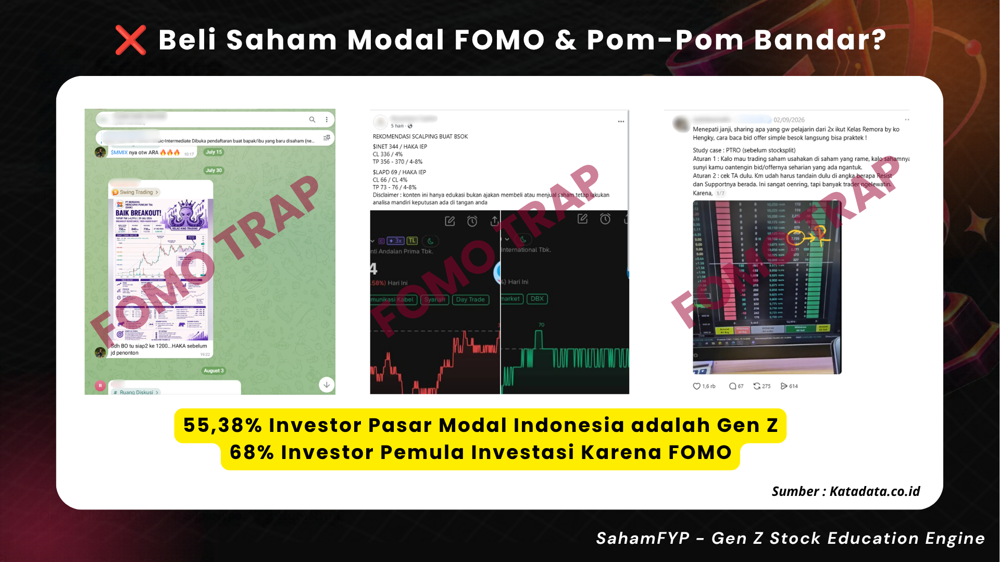
</p>

- **Kenapa Gen Z lari ke grup pom-pom & media sosial?**  
  Formatnya instan, bahasanya santai, visualnya menggoda, dan menjanjikan keuntungan cepat ("To The Moon", "Bakal Cuan Ratusan Persen!").
- **Dampaknya?**  
  **70%** Gen Z menelan info investasi mentah-mentah dari media sosial tanpa analisis data fundamental. Rata-rata hold saham hanya **1–3 bulan** karena murni FOMO trading, sering kali membeli saham di puncak harga (*pucuk*), hingga akhirnya menjadi **exit liquidity** bagi bandar dan spekulan pasar.

#### 2. Masalah 2: Dilema Riset Resmi Sekuritas — Akurat Tapi Kaku, Panjang & Bikin Pusing

<p align="center">
  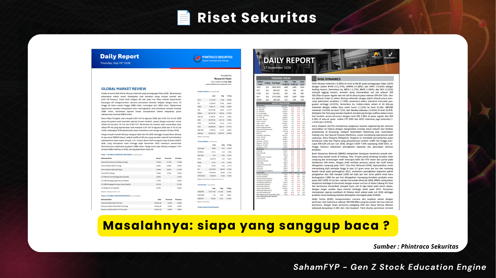
</p>

- **Kenapa Gen Z tidak membaca riset sekuritas resmi?**  
  Riset sekuritas dan keterbukaan informasi BEI sebetulnya adalah sumber rekomendasi resmi yang akurat dan berbasis data fundamental yang solid. Namun, riset ini disajikan dalam dokumen PDF 20–30+ lembar, bertabur istilah teknis rumit (DER, PBV, EBITDA margin, WACC), grafik abu-abu kaku, dan tulisan padat yang sangat tidak ramah bagi generasi *mobile-first*.
- **Dampaknya?**  
  **60%+ investor pemula** tidak melakukan analisis fundamental sebelum beli karena pusing membaca dokumen yang kaku tersebut, sehingga mereka kembali berpaling ke rumor media sosial.

### Solusi SahamFYP: Jembatan Data Riset & Bahasa Gen Z

SahamFYP mengambil **kedalaman data riset sekuritas** dan memformatnya menjadi **daya cerna konten media sosial**:
- **Bukan Ikutan Nge-Hype, Tapi Reality Check**: SahamFYP hadir dengan komitmen independen. Jika sebuah saham sedang ramai dibicarakan tetapi perusahaannya terus merugi, valuasinya tidak masuk akal, atau kepemilikan asing terus dilepas, SahamFYP akan menyatakannya secara lugas: *"Saham ini ramai, tapi fundamentalnya merah menyala — waspada jebakan FOMO!"*.
- **Bahasa Gaul Finansial & Kamus Gen Z**: Setiap istilah rumit (seperti Golden Cross, PER, atau Foreign Flow) langsung diterjemahkan dengan analogi kehidupan sehari-hari (misal: DER dianalogikan seperti limit paylater vs gaji).
- **100% Otomatis & Terverifikasi**: Menghilangkan hambatan operasional riset manual. Setiap data dipasok langsung oleh **Sectors REST API** yang kredibel.

> **Bukan Nasihat Keuangan (DYOR)**: Seluruh konten SahamFYP bersifat edukatif dan berbasis data publik untuk menumbuhkan kebiasaan riset mandiri (*Do Your Own Research*), bukan ajakan beli/jual saham tertentu.

---

## 🌟 Fitur Utama

- **Dashboard Terintegrasi** → Akses cepat untuk *Market Brief* harian dan pantauan *Stock Watchlist*.
- **News Monitoring Real-Time** → Deteksi otomatis berita dari 8 sumber RSS, filter berdasarkan rentang waktu untuk merangkum berita terkini secara dinamis.
- **Accounts Manager** → Manajemen akun sosial media terpusat (Instagram, Threads, Facebook, X, TikTok). Bisa menambah, menghapus, melihat preview link profil, serta *toggle* Active/Inactive yang tersinkronisasi langsung dengan *database* Supabase.
- **Content Generator & Multi-Publishing** → Generate konten visual AI (Form Wizard) dan kemampuan **memilih beberapa target akun sosmed** sekaligus dalam satu kali klik — untuk kebutuhan konten manual/ad-hoc di luar dua workflow otomatis di atas.
- **Full Automation Workflow (n8n)** → Dua pipeline otonom end-to-end (lihat bagian [Template Konten Postingan](#-template-konten-postingan)) dari deteksi sinyal → verifikasi data Sectors → generate → publish → laporan Telegram, tanpa intervensi manual per siklus.

---

## 🖥️ Dashboard Monitoring & Live Demo

SahamFYP dilengkapi dengan **Web Dashboard Monitoring** interaktif yang dideploy pada **Vercel Hosting** dengan database, autentikasi, serta asset storage real-time berbasis **Supabase**. Dashboard ini berfungsi sebagai pusat kontrol pemantauan pipeline berita, verifikasi data fundamental Sectors API, manajemen multi-akun media sosial, serta log posting otomatis.

### 🌐 Akses Live Demo Dashboard

| Komponen | Keterangan / Kredensial |
|---|---|
| **URL Live Web** | [https://saham-fyp.vercel.app/](https://saham-fyp.vercel.app/) |
| **Hosting Platform** | **Vercel** (Frontend React 18 + Vite & Serverless API Routes) |
| **Database & Auth** | **Supabase** (PostgreSQL Database, Auth Session, Storage bucket `sfyp-storage`) |
| **Email Demo** | `demo@sahamfyp.id` |
| **Password Demo** | `d3m0cu4n` |

### 🧭 Modul Utama Dashboard:

1. **Dashboard Overview (`/`)**
   - Ringkasan metrik pipeline automasi, total postingan, dan status kesehatan koneksi service (Sectors API, Sumopod LLM, Repliz, Supabase).
2. **News Monitoring Real-Time (`/news-monitoring`)**
   - Memantau 8 feed RSS media ekonomi nasional secara kontinu (Katadata, Kontan, Okezone, Liputan6, Detik, CNN Indonesia, CNBC Indonesia, IDX Channel).
   - Menampilkan artikel hasil scrape, klasifikasi 6 kategori berita oleh LLM, serta scoring urgensi otomatis sebelum diproduksi.
3. **Daily Market Brief (`/daily-market-brief`)**
   - Tinjauan outlook pembukaan pasar harian (08:00 WIB), pergerakan IHSG, top movers (gainers/losers), dan net foreign flow.
   - Daftar saham watchlist terseleksi beserta log konsumsi kredit Sectors API per sesi.
4. **Stock Watchlist (`/stock-watchlist`)**
   - Eksplorasi emiten yang diperkaya (*enriched*) dengan metrik fundamental resmi Sectors API (PER, PBV, ROE, DER) dan teknikal (Moving Average, Volume).
5. **Channels & Accounts Manager (`/accounts`)**
   - Manajemen terpusat akun media sosial (Instagram, TikTok, Threads, Facebook, Telegram) via Repliz & Telegram Bot.
   - Switch toggle status aktif/inaktif yang tersinkronisasi langsung dengan tabel `social_accounts` di Supabase.
6. **Posts Management & History (`/posts`)**
   - Riwayat seluruh postingan otomatis n8n dan manual generator.
   - Preview visual slide resolusi tinggi yang diunggah ke Supabase Storage, tautan post live, serta metrik interaksi.

### 📸 Preview Dashboard Monitoring (Interactive Showcase)

<p align="center">
  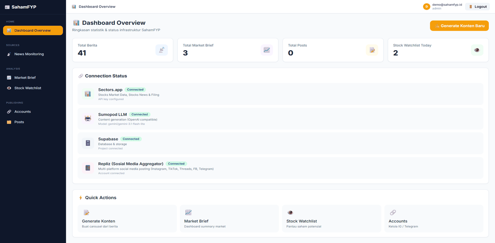
</p>

<details open>
  <summary><b>🖼️ Tangkapan Layar 1: Dashboard Overview (Main View)</b></summary>
  <p align="center">
    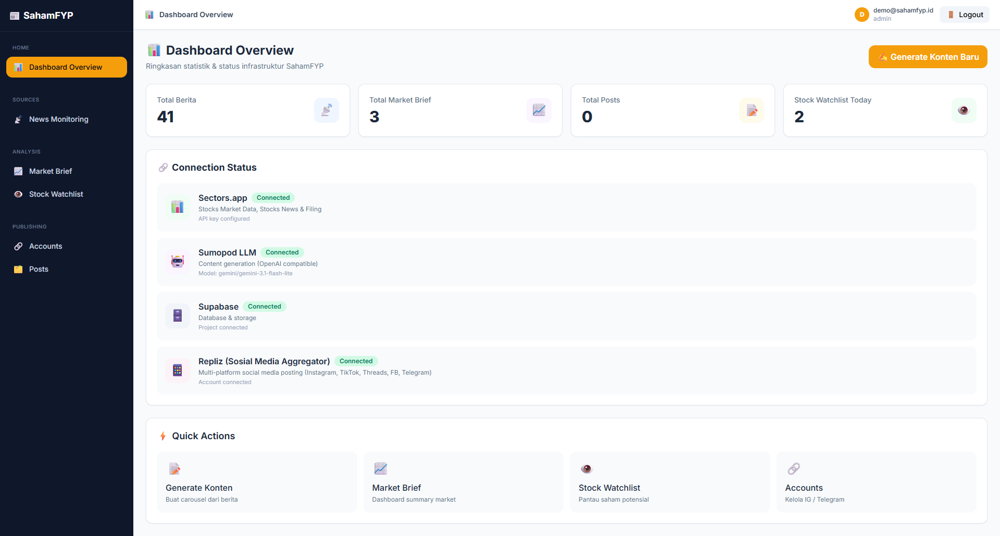
  </p>
</details>

<details>
  <summary><b>🖼️ Tangkapan Layar 2: Daily Market Brief Monitoring & Session Logs</b></summary>
  <p align="center">
    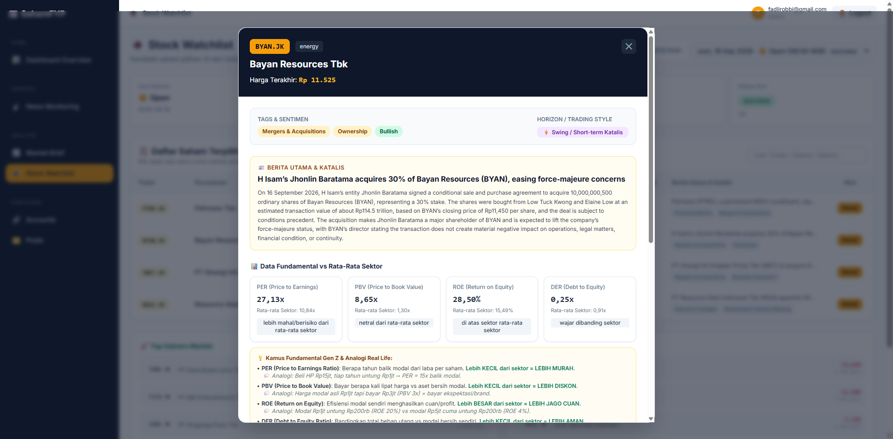
  </p>
</details>

<details>
  <summary><b>🖼️ Tangkapan Layar 3: Posts Management & Social Publishing</b></summary>
  <p align="center">
    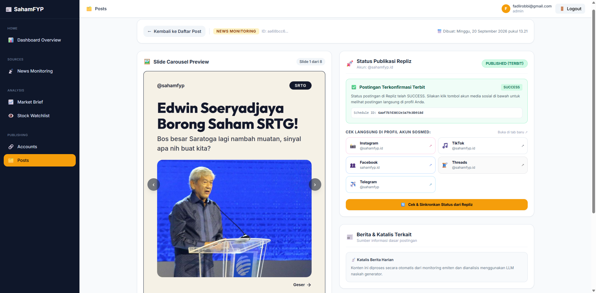
  </p>
</details>

---

## 🛠️ Tech Stack

### 1. Sectors.app — REST API (Core Data Source)

- **Fungsi**: Sumber data fundamental & pasar saham — laporan keuangan, valuation, dividen, ownership, foreign flow, broker activity, top movers, index harian, filings, dan berita pasar terverifikasi.
- **Referensi**: https://sectors.app/
- **Cara kerja**: Seluruh integrasi memakai **Sectors REST API** secara langsung (bukan MCP) lewat endpoint seperti `/v2/company/report/{ticker}/`, `/v2/daily/{ticker}/`, `/v2/brokers/top/`, `/v2/companies/top-changes/`, `/v2/news/`, `/v2/filings/`, `/v2/index-daily/{index}/`. Data ini dipanggil di **setiap** sesi Daily Market Brief dan di tahap enrichment News Monitoring — bukan panggilan dekoratif sekali pakai, melainkan tulang punggung verifikasi faktual seluruh konten yang diproduksi.

### 2. Repliz

- **Fungsi**: Publish scheduling ke berbagai media sosial (Instagram, Threads, Facebook, TikTok, Twitter/X, LinkedIn, Telegram).
- **Referensi**: https://repliz.com/ | https://api.repliz.com/public-json
- **Cara kerja**: Endpoint Vercel API `/api/publish` SahamFYP berperan sebagai orkestrator yang menerima daftar akun yang ingin dituju (`targetAccountIds`). API ini kemudian akan mengecek kredensial dinamis dari database Supabase (`social_accounts`) dan mengirim payload massal ke Repliz secara simultan.

### 3. LLM — Dual-Engine (Gemini Free Pool & Sumopod Paid)

- **Fungsi**:
  - **News Monitoring & Scoring (`/api/score`, `/api/classify`)** → Menggunakan **Google Gemini (Free Multi-Key Pool)** dengan failover otomatis untuk menyaring berita intraday sepanjang hari berdasarkan 3 Pilar Katalis (Laba naik signifikan, Buyback >20%, Dividen resmi).
  - **Daily Market Brief (`/api/sector-trigger/open`)** → Menggunakan **Sumopod (Paid Dedicated LLM)** berstandar tinggi untuk menyeleksi kandidat saham terbaik dan menyusun naskah carousel visual serta analisis fundamental-teknikal Gen Z.
- **Referensi**: https://aistudio.google.com/ | https://ai.sumopod.com/
- **Cara kerja**:
  - **Gemini Free Pool**: Dikonfigurasi via `GEMINI_API_KEY` (mendukung multiple keys dipisah koma untuk pooling), `GEMINI_BASE_URL` (`https://generativelanguage.googleapis.com/v1beta/openai`), dan `GEMINI_MODEL` (`gemini-3.1-flash-lite`).
  - **Sumopod Paid**: Dikonfigurasi via `SUMOPOD_API_KEY`, `SUMOPOD_BASE_URL` (`https://ai.sumopod.com/v1`), dan `SUMOPOD_MODEL` (`gemini/gemini-3.1-flash-lite` atau model berbayar lainnya). Dilengkapi auto-fallback ke Gemini jika key Sumopod belum dikonfigurasi.
  - Wrapper server: `api/_lib/llm.ts`; proxy browser: `/api/llm` — API key tidak pernah ter-expose ke bundle client.

### 4. Penyimpanan Gambar: Supabase Storage

- **Fungsi**: Engine rendering gambar dan penyimpanan CDN publik berkecepatan tinggi
- **Status**: Seluruh pipeline otomatis (Daily Market Brief dan News Monitoring) 100% menggunakan **Supabase Storage** (bucket `sfyp-storage`).
- **Cara kerja**:
  - **Browserless.io** digunakan oleh workflow n8n untuk mengubah skrip HTML (berisi data fundamental & berita) menjadi gambar beresolusi tinggi (JPEG 1080×1350).
  - Gambar hasil render diunggah langsung ke **Supabase Storage** (bucket `sfyp-storage`); URL publiknya dikumpulkan sebagai payload `imageUrls` yang diteruskan ke API publish Repliz, menjamin ketersediaan aset gambar tanpa risiko throttle atau blokir pihak ketiga.

### 5. Supabase

- **Fungsi**: Database utama, Single Source of Truth, dan Object Storage.
- **Referensi**: https://supabase.com/
- **Cara kerja**:
  - **Tabel Utama**: `sector_trigger_news` (log eksekusi n8n & berita, jadi bukti unattended run), `social_accounts` (database akun sosmed & status aktif/inaktif), `automation_posts` (riwayat publish otomatis n8n), dan `generated_posts` (status posting).
  - **Storage**: Menggunakan bucket publik `sfyp-storage` untuk menyimpan seluruh slide visual beresolusi tinggi yang dihasilkan pipeline otomatis.

<p align="center">
  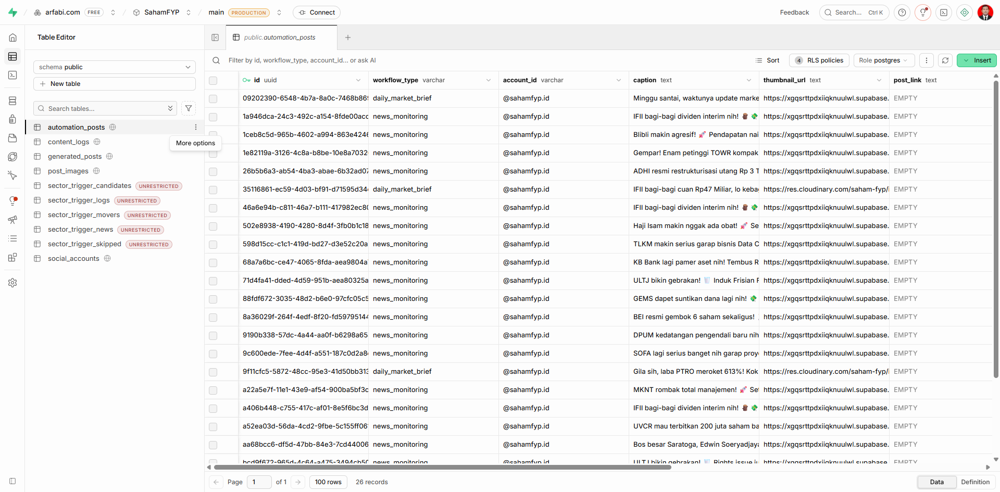
</p>

### 6. Vercel

- **Fungsi**:
  - Hosting untuk aplikasi web (frontend React + Vite)
  - Serverless functions (Vercel Functions) untuk API routes (`/api/*`)
- **Referensi**: https://vercel.com/
- **Cara kerja**:
  - Setiap file di `api/` folder di-deploy sebagai Vercel Function
  - Build command: `node scripts/sync-env.mjs && npm run build`
  - Output directory: `dist`
  - Config di `vercel.json` untuk routing & rewrites

### 7. n8n

- **Fungsi**: Workflow automation sebagai orchestrator utama untuk dua pipeline otonom (Daily Market Brief & News Monitoring) — menghubungkan Sectors REST API, LLM, storage, dan publish tanpa intervensi manual per siklus.
- **Referensi**: https://n8n.io/
- **Cara kerja**:
  - Template workflow JSON siap pakai tersedia di folder [`n8n_workflows_template/`](n8n_workflows_template/) (token API dan kredensial sudah diset ke placeholder sebelum commit)
  - Trigger: schedule (Daily Market Brief, 08:00 WIB) atau RSS event trigger (News Monitoring, tiap menit polling)
  - Setiap step memanggil API SahamFYP atau service langsung

### 8. Telegram Bot

- **Fungsi**: Notifikasi status tiap sesi otomatis: berhasil / gagal / scheduled — sekaligus menjadi bukti unattended run (timestamp + hasil tiap eksekusi tanpa operator).
- **Referensi**: https://core.telegram.org/bots
- **Cara kerja**: Menggunakan Telegram Bot API untuk kirim notifikasi ke user/group yang diset.

### 9. React + Vite

- **Fungsi**: Web engine / dashboard / form wizard — UI untuk monitoring, manual post, dan form wizard
- **Referensi**: https://vitejs.dev/ | https://react.dev/
- **Plugin yang digunakan**:
  - `@vitejs/plugin-react` — React Fast Refresh & JSX support
  - `vite` (versi `^5.4.0`) — build tool & dev server
  - `tailwindcss` (versi `^3.4.10`) — styling & design system
- **Cara kerja**:
  - Vite sebagai build tool & dev server
  - React untuk component-based UI
  - Build output ke `dist/` folder
  - Deploy ke Vercel

---

## 📑 Template Konten Postingan

SahamFYP mengotomatisasi produksi konten edukasi dan riset pasar modal melalui dua pipeline n8n: **Daily Market Brief** (terjadwal sebelum jam bursa) dan **Monitoring News** (event-driven real-time saat ada berita baru / keterbukaan informasi).

---

### 1. Daily Market Brief

Workflow harian otomatis terjadwal yang dieksekusi setiap pagi pukul **08:00 WIB** sebelum pembukaan bursa saham Indonesia.

#### a. Workflow Automasi (n8n)

Dalam satu sesi eksekusi unattended, workflow ini memanggil serangkaian endpoint Sectors REST API untuk merangkum kondisi pasar, menyusun watchlist saham potensial, me-render visual carousel resolusi tinggi (JPEG 1080×1350) via Browserless, menyimpan aset ke Supabase Storage, menerbitkan ke berbagai media sosial melalui Repliz, dan mengirimkan laporan eksekusi lengkap ke Telegram.

<p align="center">
  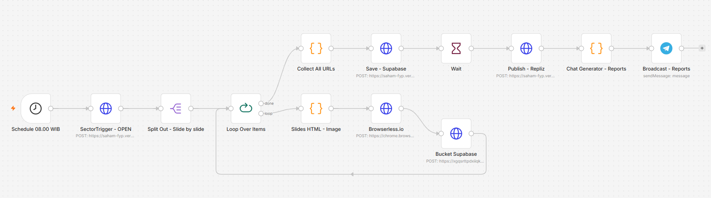
</p>

- **Download / Import Workflow JSON**: 📄 [**`SahamFYP - Daily Market Brief.json`**](n8n_workflows_template/SahamFYP%20-%20Daily%20Market%20Brief.json)
- **Konfigurasi Kredensial**: Seluruh API key dan token sensitif di dalam file JSON template ini telah disiapkan dengan placeholder `MASUKKAN KEY API ANDA DISINI` agar siap di-import langsung ke workspace n8n Anda (*Workflows > Import from File*).

**Alur Eksekusi:**
```
Schedule Trigger (08:00 WIB)
  → SectorTrigger/open:
      1. Fetch berita curated langsung dari Sectors REST API (/v2/news/)
      2. Otomatis simpan berita baru ke Supabase (sector_trigger_news)
      3. Seleksi saham watchlist & generate naskah via Paid Dedicated LLM (Sumopod)
      4. Enrich rasio fundamental & broker foreign flow vs rata-rata sektor
  → Split Out per Slide → Render HTML → Browserless.io (HTML → JPEG 1080×1350)
  → Upload ke Supabase Storage (bucket sfyp-storage) → Collect All URLs
  → Publish ke Repliz (multi-akun: Instagram, Facebook, Threads, X, TikTok)
  → Simpan log riwayat post ke Supabase (/api/posts)
  → Kirim broadcast laporan status & credits used ke Telegram
```

**Log Eksekusi Nyata Sectors API (Satu Sesi Trigger):**

| Waktu | Endpoint Sectors API | Tipe | Status | Credits |
|---|---|---|---|---|
| 10:17 | `/v2/daily/INET.JK/` | Direct API | 200 | 1 |
| 10:17 | `/v2/company/report/PTRO.JK/` | Direct API | 200 | 3 |
| 10:17 | `/v2/company/report/BYAN.JK/` | Direct API | 200 | 3 |
| 10:17 | `/v2/company/report/INET.JK/` | Direct API | 200 | 3 |
| 10:17 | `/v2/daily/BYAN.JK/` | Direct API | 200 | 1 |
| 10:17 | `/v2/daily/MBMA.JK/` | Direct API | 200 | 1 |
| 10:17 | `/v2/daily/PTRO.JK/` | Direct API | 200 | 1 |
| 10:17 | `/v2/company/report/MBMA.JK/` | Direct API | 200 | 3 |
| 10:17 | `/v2/brokers/top/` | Direct API | 200 | 2 |
| 10:17 | `/v2/companies/top-changes/` | Direct API | 200 | 2 |
| 10:17 | `/v2/news/` | Direct API | 200 | 1 |
| 10:17 | `/v2/filings/` | Direct API | 200 | 1 |
| 10:17 | `/v2/index-daily/ihsg/` | Direct API | 200 | 1 |

#### b. Template Konten Daily Brief

<p align="center">
  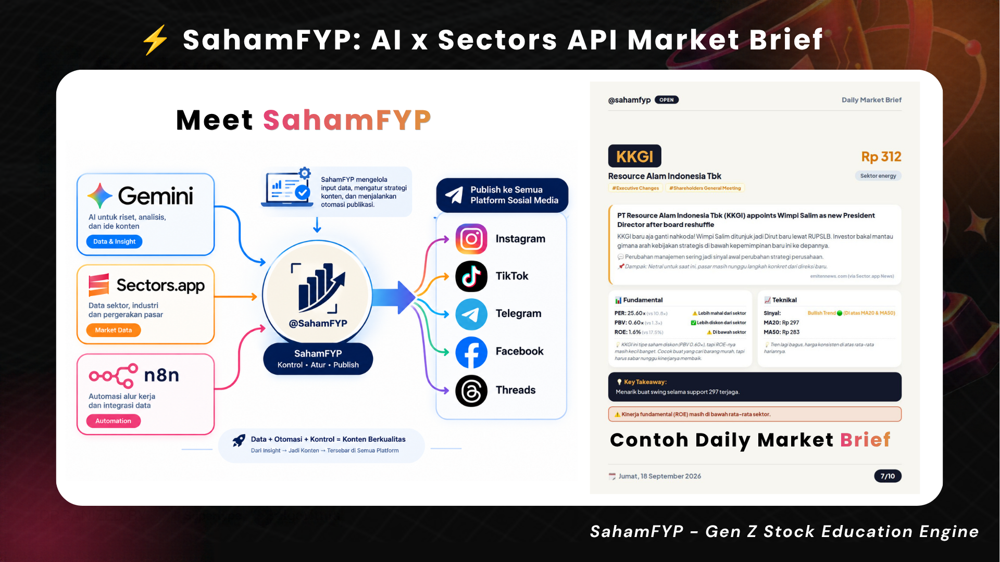
</p>

##### 1) Market Open (08:00 WIB) — ✅ Live di Media Sosial
Memberikan outlook pasar sebelum bursa buka dengan komposisi slide dinamis:

| Slide | Fungsi | Keterangan |
|-------|--------|------------|
| 1 | **COVER** | Judul "Market Open" + Tanggal + Jumlah Watchlist |
| 2 | **TLDR** | Ringkasan IHSG kemarin, Top Gainers/Losers, Foreign Flow, Berita Utama |
| 3 | **KONDISI MARKET** | Data metrik market kemarin (IHSG, Foreign Flow, Gainers & Losers) |
| 4...N | **STOCK SLIDES** | Bedah fundamental, teknikal, dan vibe check per saham watchlist (berulang per saham) |
| N+1 | **MATRIX** | Kesimpulan posisi saham di Kuadran Fundamental × Teknikal |
| N+2 | **KAMUS** | Penjelasan istilah saham ala Gen Z |
| N+3 | **CTA** | Ajakan diskusi di komentar |

##### 2) Market Close (17:00 WIB) — 🚧 Roadmap / Terencana
Dirancang untuk merangkum pergerakan bursa pasca-penutupan pasar modal:

| Slide | Fungsi | Keterangan |
|-------|--------|------------|
| 1 | **COVER** | Judul "Recap Market" + Tanggal |
| 2 | **TLDR** | Ringkasan angka penutupan IHSG & Top Gainers/Losers |
| 3 | **KRONOLOGI** | Narasi singkat pergerakan IHSG hari ini |
| 4 | **DATA** | Angka detail Gainer, Loser & Volume |
| 5 | **PROS** | Broker asing akumulasi terbesar & saham yang diborong |
| 6 | **CONS** | Sektor yang underperform & perlu diwaspadai |
| 7 | **KESIMPULAN** | Ringkasan netral dari pergerakan harga hari ini |
| 8 | **CTA** | Ajakan diskusi & Disclaimer DYOR |

---

### 2. Monitoring News

Pipeline otonom event-driven yang berjalan kontinu memantau **8 sumber RSS media ekonomi terkemuka** di Indonesia (Katadata, Kontan, Okezone, Liputan6, Detik, CNN Indonesia, CNBC Indonesia, IDX Channel).

#### a. Workflow Automasi (n8n)

Setiap menit, workflow memfilter berita baru, mengecek duplikasi URL, men-scrape teks artikel lengkap, mengklasifikasikan kategori & ticker saham, memberi skor urgensi, dan meneruskan berita berkatalis kuat ke tahap enrichment data Sectors API untuk diproduksi menjadi carousel visual.

<p align="center">
  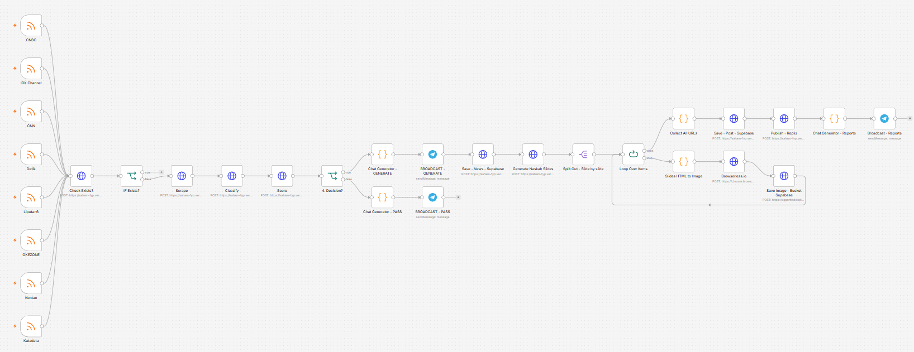
</p>

- **Download / Import Workflow JSON**: 📄 [**`SahamFYP - News Monitoring.json`**](n8n_workflows_template/SahamFYP%20-%20News%20Monitoring.json)
- **Konfigurasi Kredensial**: Seluruh API key dan token sensitif di dalam file JSON template ini telah disiapkan dengan placeholder `MASUKKAN KEY API ANDA DISINI` sehingga aman dan siap pakai.

**Alur Eksekusi:**
```
RSS Trigger (8 sumber media ekonomi, polling tiap menit)
  → Cek duplikat (/api/news-scrape, cegah pemrosesan berita berulang)
  → Scrape isi artikel penuh (/api/scrape)
  → Classify kategori & ticker (/api/classify — LLM, 6 kategori)
  → Score urgensi/relevansi (/api/score)
  → Decision gate:
      • PASS (berita kurang kuat/relevan → skip, log singkat ke Telegram)
      • GENERATE (berita berkatalis kuat → lanjut ke pipeline produksi)
  → Enrich dengan Sectors REST API sesuai kategori konten
  → Generate naskah (LLM) → Render HTML Slide → Browserless.io (HTML → JPEG)
  → Upload gambar ke Supabase Storage (bucket sfyp-storage)
  → Publish ke Repliz (multi-platform) → Update status di Supabase → Broadcast laporan ke Telegram
```

#### b. Template Konten & Klasifikasi Berita

<p align="center">
  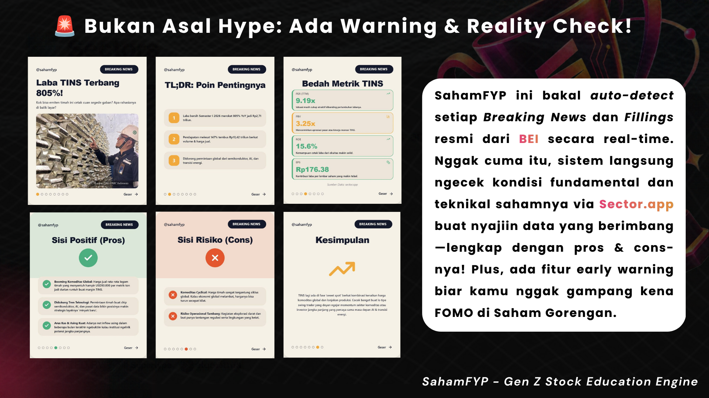
</p>

##### 1) Klasifikasi Berita Otomatis
- **Endpoint**: `POST /api/classify`
- **Fungsi**: Mengklasifikasikan berita ke dalam salah satu dari 6 kategori utama dengan menentukan kategori terbaik dan ticker yang relevan
- **Kategori**: `SINGLE_STOCK`, `MACRO_ECONOMY`, `SECTOR_ANALYSIS`, `CORPORATE_ACTION`, `IPO_RIGHTS_ISSUE`, `SUSPENSION_DELISTING`
- **Output**: JSON berisi `{category, ticker?, confidence}`
- **Model**: Sumopod `gemini/gemini-3.1-flash-lite` (OpenAI compatible, bisa diganti via `SUMOPOD_MODEL`)

##### 2) Struktur Konten 8 Slide Carousel
Semua kategori berita menggunakan struktur **8 slide carousel** yang konsisten:

| Slide | Fungsi | Keterangan |
|-------|--------|------------|
| 1 | **COVER** | Headline menarik + sub-judul |
| 2 | **TLDR** | Ringkasan cepat dalam poin-poin |
| 3 | **KRONOLOGI** | Konteks berita (apa, kapan, siapa) + sumber |
| 4 | **Data Enrichment** | **Beda per kategori** (lihat rincian di bawah) — sumber: Sectors REST API |
| 5 | **Point + Explanation** | **Beda per kategori** (sisi positif / peluang) |
| 6 | **Point + Explanation** | **Beda per kategori** (sisi risiko / warning) |
| 7 | **KESIMPULAN** | Rangkuman edukatif netral |
| 8 | **CTA_DYOR** | Diskusi + disclaimer DYOR |

##### 3) 6 Kategori & Spesialisasi Slide 4–6

**1. SINGLE_STOCK — Analisis Emiten Tunggal**
- Slide 4: `BEDAH_DATA` — PER, PBV, ROE, ROA, EPS TTM, Foreign Flow
- Slide 5: `PROS` — Sisi positif emiten dengan point & explanation
- Slide 6: `CONS` — Sisi risiko dengan point & explanation
- **Sectors REST API endpoints**: `/v2/company/report/{ticker}/` (sections: `overview`, `valuation`, `financials`, `future`, `dividend`, `ownership`) + `/v2/daily/{ticker}/` (foreign flow)

**2. MACRO_ECONOMY — Makro Ekonomi & Tren Pasar**
- Slide 4: `DAMPAK_PASAR` — Dampak kebijakan makro ke IHSG & portofolio
- Slide 5: `DIUNTUNGKAN` — Saham/sector yang diuntungkan kebijakan tersebut
- Slide 6: `PERLU_DIWASPADAI` — Risiko & hal yang perlu diwaspadai
- **Sectors REST API endpoints**: `/v2/index-daily/ihsg/` + `/v2/companies/top-changes/` + `/v2/company/report/{ticker}/` (ringan)

**3. SECTOR_ANALYSIS — Tren Sektor & Emiten Terkait**
- Slide 4: `DATA_SEKTOR` — Data sektor (market cap, korelasi, top stocks)
- Slide 5: `SAHAM_JAGOAN` — Saham-saham yang mendominasi sektor
- Slide 6: `PERLU_DIWASPADAI` — Risiko & catatan khusus sektor
- **Sectors REST API endpoints**: data sektor + `/v2/company/report/{ticker}/` (untuk beberapa emiten)

**4. CORPORATE_ACTION — Aksi Korporasi**
- Slide 4: `DETAIL_AKSI` — Jadwal & detail aksi (bonus, cuan, dividend, split, dll)
- Slide 5: `UNTUNG_BUAT_INVESTOR` — Pengaruh aksi ke investor
- Slide 6: `PERLU_DIPERHATIKAN` — Hal yang perlu diperhatikan sebelum/after aksi
- **Sectors REST API endpoints**: `/v2/filings/` + `/v2/company/report/{ticker}/` (sections: `overview`) — ringan

**5. IPO_RIGHTS_ISSUE — IPO & Penawaran Emiten**
- **(5A) Emiten dengan prospektus & data jelas**
  - Slide 4: `SKEMA_AKSI` — Skema penawaran (harga, lot, discount, jadwal)
  - Slide 5: `UNTUNG_BUAT_INVESTOR` — Potensi keuntungan
  - Slide 6: `RISIKO` — Risiko investasi IPO
  - **Sectors REST API endpoints**: `/v2/company/report/{ticker}/` (sections: `overview`) — ringan
- **(5B) Emiten dengan info terbatas**
  - Slide 4: `DETAIL_PENAWARAN` — Detail yang tersedia (hanya yang public)
  - Slide 5: `PROFIL_PERUSAHAAN` — Profil singkat yang diketahui
  - Slide 6: `KENAPA_MENARIK` — Faktor menarik + keberadaan risiko
  - **Sectors REST API endpoints**: Tidak ada — 100% dari teks berita hasil scrape

**6. SUSPENSION_DELISTING — Suspensi & Delisting**
- Slide 4: `FAKTA_SUSPENSI` — Fakta dasar suspensi (status, ticker, kapan dimulai)
- Slide 5: `APA_ITU_SUSPENSI` — Edukasi tentang suspensi (mekanisme, tipe, cooling down vs delisting)
- Slide 6: `YANG_PERLU_DILAKUKAN` — Langkah yang bisa dilakukan investor
- **Sectors REST API endpoints**: data suspensi + `/v2/company/report/{ticker}/` (sections: `overview`)

##### 4) Standar Wajib & Referensi Detail
- Semua kategori **8 slide** — konsistensi pagination di tiap carousel
- Slide 1, 2, 7, 8 **format relatif sama** di semua kategori (bisa reuse komponen)
- Slide 3, 4, 5, 6 **berbeda per kategori** — masing-masing butuh komponen/template tersendiri
- Format **point + explanation** pada slide 5 & 6 adalah **standar wajib** di semua kategori
- Konten bersifat **edukatif & netral** — tidak mengajak beli/jual, melainkan memberi perspektif & data
- Selengkapnya baca di: [`docs/Struktur_Konten_6_Kategori_SahamFYP.md`](docs/Struktur_Konten_6_Kategori_SahamFYP.md)

---

## 📦 Cara Duplikasi / Clone Content Engine

### System Requirements

- **Node.js**: versi 18+ (direkomendasikan LTS)
- **npm**: 9+
- **Git**: untuk clone repo
- **API Dependencies**:
  - Sectors.app API key (REST API): https://sectors.app/ — **wajib**, tanpa ini produk tidak berfungsi
  - Sumopod API key (OpenAI-compatible LLM): https://ai.sumopod.com/
  - Repliz account & API key: https://repliz.com/
  - Supabase project & credentials: https://supabase.com/
  - n8n instance (self-hosted or cloud): https://n8n.io/
  - Telegram bot token (jika pakai notifikasi Telegram): https://core.telegram.org/bots
  - **Vercel account**: untuk deploy backend & frontend

> ⚠️ **Keamanan**: jangan pernah commit API key/token asli (termasuk di file workflow JSON n8n) ke repository publik. Ganti dengan placeholder/environment variable sebelum push. Kalau terlanjur bocor, rotate key tersebut segera di provider terkait sebelum melakukan commit apa pun.

### Langkah Instalasi

```bash
# 1. Clone repo
git clone https://github.com/arfabi/sahamFYP.git
cd sahamFYP

# 2. Install dependencies
npm install

# 3. Setup environment variables
# Copy .env.example ke .env.local dan isi semua variabel yang dibutuhkan
cp .env.example .env.local

# 4. Setup database Supabase
# Skema tabel DDL lengkap tersedia di folder supabase/migrations/
# Seed data / baris tabel siap pakai tersedia di folder supabase/table/
# Jalankan SQL DDL di Supabase SQL Editor (lihat skema lengkap di bawah)

# 5. Setup Supabase Storage
# Buat bucket bernama "sfyp-storage" di dashboard Supabase dan pastikan diset sebagai Public.
# Seluruh render gambar otomatis disimpan ke bucket ini.

# 6. Test local development
npm run dev

# 7. Build for production
npm run build
```

### Environment Variables

Buat file `.env.local` dengan variabel berikut:

```bash
# Sectors.app (REST API — core data source, wajib)
SECTORS_API_KEY=your_sectors_api_key_here

# 1. LLM — News Monitoring (Google Gemini Free / Multi-Key Pool)
GEMINI_API_KEY=your_gemini_api_key_here
GEMINI_BASE_URL=https://generativelanguage.googleapis.com/v1beta/openai
GEMINI_MODEL=gemini-3.1-flash-lite

# 2. LLM — Daily Market Brief open.ts (Sumopod / Paid Dedicated LLM)
SUMOPOD_API_KEY=your_sumopod_paid_api_key_here
SUMOPOD_BASE_URL=https://ai.sumopod.com/v1
SUMOPOD_MODEL=gemini/gemini-3.1-flash-lite

# Repliz
REPLIZ_ACCESS_KEY=your_repliz_access_key
REPLIZ_SECRET_KEY=your_repliz_secret_key
REPLIZ_ACCOUNT_ID=your_repliz_account_id
# Opsional: TikTok account ID (jika beda dari Instagram)
REPLIZ_TIKTOK_ACCOUNT_ID=your_repliz_tiktok_account_id_optional

# Browserless (HTML → image renderer)
BROWSERLESS_IO_KEY=your_browserless_api_key

# Supabase
SUPABASE_URL=your_supabase_project_url
SUPABASE_ANON_KEY=your_supabase_anon_key
SUPABASE_SERVICE_ROLE_KEY=your_supabase_service_role_key

# n8n
# Dipakai untuk autentikasi webhook calls dari n8n ke endpoint:
# /api/enrich, /api/generate, /api/posts, /api/publish, /api/llm, /api/classify, /api/score, /api/news-scrape, /api/sector-trigger/open
N8N_API_KEY=your_n8n_api_key_optional

# Telegram Bot (opsional)
TELEGRAM_BOT_TOKEN=your_telegram_bot_token_optional
TELEGRAM_CHAT_ID=your_telegram_chat_id_optional
```

### Database Schema & Seed (Supabase)

Struktur database SahamFYP dapat diinisialisasi melalui **Supabase SQL Editor**.
- **File Migrasi DDL**: Tersedia lengkap dan terurut di folder [`supabase/migrations/`](supabase/migrations/)
- **File Data Row / Seed**: Tersedia di folder [`supabase/table/`](supabase/table/)

<details open>
  <summary><b>📸 Preview Tabel Database Supabase (Live View)</b></summary>
  <p align="center">
    
  </p>
</details>

#### Urutan Eksekusi Seed / Import Data yang Benar:
Karena adanya relasi Foreign Key antar tabel, eksekusi file row/seed di Supabase SQL Editor **wajib berurutan** sebagai berikut:
1. `social_accounts_rows.sql` *(Akun sosmed tujuan publikasi)*
2. `automation_posts_rows.sql` *(Riwayat postingan workflow otonom)*
3. `sector_trigger_logs_rows.sql` *(Tabel induk log trigger harian — WAJIB sebelum tabel trigger di bawahnya)*
4. `sector_trigger_news_rows.sql` *(Berita & katalis harian, relasi ke logs)*
5. `sector_trigger_candidates_rows.sql` *(Kandidat saham terpilih & analisa fundamental, relasi ke logs)*
6. `sector_trigger_movers_rows.sql` *(Top gainer & loser harian, relasi ke logs)*
7. `sector_trigger_skipped_rows.sql` *(Emiten yang diskip AI & alasannya, relasi ke logs)*
8. `generated_posts_rows.sql` *(Data postingan naskah carousel & status repliz)*
9. `post_images_rows.sql` *(Daftar URL gambar slide postingan)*

#### Schema DDL Lengkap (Idempotent):

```sql
-- 1. Tabel social_accounts (Manajemen akun sosial media multi-platform)
CREATE TABLE IF NOT EXISTS public.social_accounts (
  id UUID DEFAULT gen_random_uuid() PRIMARY KEY,
  platform TEXT NOT NULL, -- 'instagram', 'telegram', 'tiktok', 'facebook', 'threads', 'twitter', 'linkedin'
  provider TEXT NOT NULL, -- 'repliz', 'telegram'
  account_id TEXT NOT NULL, -- ID Akun Repliz atau Chat ID Telegram
  account_name TEXT NOT NULL, -- e.g. '@sahamfyp'
  is_active BOOLEAN DEFAULT TRUE,
  created_at TIMESTAMPTZ DEFAULT timezone('utc'::text, now())
);

-- 2. Tabel automation_posts (Riwayat postingan otomatis dari workflow n8n)
CREATE TABLE IF NOT EXISTS public.automation_posts (
  id UUID DEFAULT gen_random_uuid() PRIMARY KEY,
  workflow_type VARCHAR(50) NOT NULL, -- 'news_monitoring' atau 'daily_market_brief'
  account_id VARCHAR(100),
  caption TEXT,
  thumbnail_url TEXT,
  post_link TEXT,
  post_id VARCHAR(100),
  status VARCHAR(50) DEFAULT 'success',
  created_at TIMESTAMPTZ DEFAULT timezone('utc'::text, now()) NOT NULL,
  updated_at TIMESTAMPTZ DEFAULT timezone('utc'::text, now()) NOT NULL
);

-- 3. Tabel content_logs (Log analisis berita, scraping, & scoring naskah)
CREATE TABLE IF NOT EXISTS public.content_logs (
  id UUID DEFAULT gen_random_uuid() PRIMARY KEY,
  url TEXT NOT NULL,
  title TEXT,
  content TEXT,
  scraped_at TIMESTAMPTZ,
  category VARCHAR(50),
  ticker VARCHAR(50),
  sector VARCHAR(100),
  confidence NUMERIC,
  reason TEXT,
  sectors_data JSONB,
  status VARCHAR(50) DEFAULT 'pending',
  error_message TEXT,
  created_at TIMESTAMPTZ DEFAULT timezone('utc'::text, now()) NOT NULL,
  updated_at TIMESTAMPTZ DEFAULT timezone('utc'::text, now()) NOT NULL
);

-- 4. Tabel generated_posts (Generator naskah & status publish wizard)
CREATE TABLE IF NOT EXISTS public.generated_posts (
  id UUID DEFAULT gen_random_uuid() PRIMARY KEY,
  log_id UUID REFERENCES public.content_logs(id) ON DELETE SET NULL,
  handle VARCHAR(100) DEFAULT '@sahamfyp',
  badge_text VARCHAR(100) NOT NULL DEFAULT 'SAHAMFYP',
  badge_bg_color VARCHAR(50),
  badge_text_color VARCHAR(50),
  slides_json JSONB NOT NULL DEFAULT '[]'::jsonb,
  total_slides INTEGER DEFAULT 8,
  created_at TIMESTAMPTZ DEFAULT timezone('utc'::text, now()) NOT NULL,
  updated_at TIMESTAMPTZ DEFAULT timezone('utc'::text, now()) NOT NULL,
  instagram_status VARCHAR(50) DEFAULT 'generated',
  tiktok_status VARCHAR(50) DEFAULT 'generated',
  schedule_id VARCHAR(100),
  tiktok_schedule_id VARCHAR(100),
  permalink TEXT,
  permalink_ig TEXT,
  permalink_tiktok TEXT,
  likes INTEGER DEFAULT 0,
  comments INTEGER DEFAULT 0,
  shares INTEGER DEFAULT 0,
  reach INTEGER DEFAULT 0
);

-- 5. Tabel post_images (Penyimpanan aset URL slide gambar)
CREATE TABLE IF NOT EXISTS public.post_images (
  id UUID DEFAULT gen_random_uuid() PRIMARY KEY,
  post_id UUID REFERENCES public.generated_posts(id) ON DELETE CASCADE,
  slide_number INTEGER NOT NULL,
  template_type VARCHAR(50),
  cloudinary_url TEXT,
  cloudinary_public_id TEXT,
  width INTEGER,
  height INTEGER,
  file_size BIGINT,
  created_at TIMESTAMPTZ DEFAULT timezone('utc'::text, now()) NOT NULL
);

-- 6. Tabel sector_trigger_logs (Log sesi eksekusi Daily Market Brief)
CREATE TABLE IF NOT EXISTS public.sector_trigger_logs (
  id UUID DEFAULT gen_random_uuid() PRIMARY KEY,
  session TEXT NOT NULL CHECK (session IN ('open', 'close')),
  trigger_date DATE NOT NULL,
  data_date DATE NOT NULL,
  ihsg_price NUMERIC,
  ihsg_change NUMERIC,
  credits_used INTEGER DEFAULT 0,
  tickers_selected INTEGER DEFAULT 0,
  news_fetched INTEGER DEFAULT 0,
  reasoning TEXT,
  status TEXT DEFAULT 'success' CHECK (status IN ('success', 'no_candidates', 'error')),
  error_message TEXT,
  created_at TIMESTAMPTZ DEFAULT NOW()
);

-- 7. Tabel sector_trigger_news (Koleksi berita pasar, keterbukaan informasi, & scoring)
CREATE TABLE IF NOT EXISTS public.sector_trigger_news (
  id UUID DEFAULT gen_random_uuid() PRIMARY KEY,
  log_id UUID REFERENCES public.sector_trigger_logs(id) ON DELETE CASCADE,
  news_index INTEGER,
  title TEXT,
  body TEXT,
  tags TEXT[],
  symbols TEXT[],
  sector TEXT,
  sub_sectors TEXT[],
  dimensions JSONB,
  source_url TEXT,
  thumbnail_url TEXT,
  timestamp TIMESTAMPTZ,
  published_at TIMESTAMPTZ,
  raw JSONB,
  is_selected BOOLEAN DEFAULT FALSE,
  category TEXT,
  description TEXT,
  sitename TEXT,
  score INTEGER DEFAULT 0,
  decision TEXT DEFAULT 'PASS',
  reason TEXT,
  created_at TIMESTAMPTZ DEFAULT NOW(),
  updated_at TIMESTAMPTZ DEFAULT NOW()
);

-- 8. Tabel sector_trigger_candidates (Kandidat saham terpilih + enrichment Sectors API)
CREATE TABLE IF NOT EXISTS public.sector_trigger_candidates (
  id UUID DEFAULT gen_random_uuid() PRIMARY KEY,
  log_id UUID REFERENCES public.sector_trigger_logs(id) ON DELETE CASCADE,
  ticker TEXT NOT NULL,
  company_name TEXT,
  sector TEXT,
  news_title TEXT,
  news_tags TEXT[],
  news_body TEXT,
  price NUMERIC,
  market_cap NUMERIC,
  pe_ratio NUMERIC,
  pb_ratio NUMERIC,
  roe NUMERIC,
  der NUMERIC,
  revenue NUMERIC,
  net_income NUMERIC,
  avg_sector_pe NUMERIC,
  avg_sector_pbv NUMERIC,
  avg_sector_roe NUMERIC,
  avg_sector_der NUMERIC,
  pe_signal TEXT,
  pbv_signal TEXT,
  roe_signal TEXT,
  der_signal TEXT,
  enrichment_json JSONB,
  technical_json JSONB,
  created_at TIMESTAMPTZ DEFAULT NOW()
);

-- 9. Tabel sector_trigger_movers (Top gainers & top losers harian)
CREATE TABLE IF NOT EXISTS public.sector_trigger_movers (
  id UUID DEFAULT gen_random_uuid() PRIMARY KEY,
  log_id UUID REFERENCES public.sector_trigger_logs(id) ON DELETE CASCADE,
  classification TEXT CHECK (classification IN ('top_gainers', 'top_losers')),
  symbol TEXT NOT NULL,
  company_name TEXT,
  price_change NUMERIC,
  last_price NUMERIC,
  point_change NUMERIC,
  created_at TIMESTAMPTZ DEFAULT NOW()
);

-- 10. Tabel sector_trigger_skipped (Saham yang diskip AI beserta alasannya)
CREATE TABLE IF NOT EXISTS public.sector_trigger_skipped (
  id UUID DEFAULT gen_random_uuid() PRIMARY KEY,
  log_id UUID REFERENCES public.sector_trigger_logs(id) ON DELETE CASCADE,
  ticker TEXT NOT NULL,
  reason TEXT,
  created_at TIMESTAMPTZ DEFAULT NOW()
);
```

### Deploy ke Vercel

```bash
# 1. Install Vercel CLI (jika belum)
npm install -g vercel

# 2. Login ke Vercel
vercel login

# 3. Deploy
vercel

# Atau pakai Vercel dashboard: https://vercel.com/new
```

Set environment variables di Vercel dashboard (Settings > Environment Variables) sesuai variabel di atas.

> **Note**: Anda TIDAK PERLU menambahkan VITE_ keys secara manual. Build command `node scripts/sync-env.mjs && npm run build` akan auto-generate VITE_ duplicates dari non-prefixed keys (lihat `.env.example` dan `scripts/sync-env.mjs`).

### Setup n8n Workflow

1. Buat n8n instance (self-hosted atau cloud)
2. Import kedua workflow JSON: `Daily Market Brief` (schedule trigger 08:00 WIB) dan `News Monitoring` (RSS trigger, 8 sumber, poll tiap menit)
3. Isi credential (Sectors API key, N8N_API_KEY, Telegram, dsb) — jangan hardcode token di node
4. Hubungkan API nodes ke endpoint SahamFYP:
   - `POST /api/sector-trigger/open` → mulai sesi Daily Market Brief
   - `POST /api/scrape`, `/api/classify`, `/api/score`, `/api/news-scrape` → pipeline News Monitoring
   - `POST /api/enrich` → enrich dengan Sectors REST API
   - `POST /api/generate` → generate slide & caption
   - `POST /api/publish` → publish ke Repliz
5. Setup notifikasi Telegram sebagai bukti unattended run

---

## 📁 Struktur Project

```
sahamFYP/
├── api/
│   ├── _lib/              # Shared utilities
│   ├── classify.ts        # Klasifikasi berita endpoint
│   ├── score.ts           # Scoring urgensi/relevansi berita endpoint
│   ├── enrich.ts          # Enrichment data Sectors REST API endpoint
│   ├── generate.ts        # Generate konten (slide + caption) endpoint
│   ├── news-scrape.ts     # Dedup check & simpan berita scraped endpoint
│   ├── sector-trigger/
│   │   └── open.ts        # Trigger sesi Daily Market Brief endpoint
│   ├── posts/
│   │   └── index.ts       # Posts management endpoints
│   ├── publish.ts         # Publish ke Repliz endpoint
│   ├── scrape.ts          # Scrape isi artikel penuh endpoint
│   └── health.ts          # Health check endpoint
├── src/
│   ├── components/        # React components
│   │   ├── manualEditorData.ts
│   │   ├── templatesData.ts
│   │   └── ...
│   ├── services/          # API services (Supabase, dll)
│   │   ├── repliz.ts
│   │   └── supabase.ts
│   ├── prompts/           # Prompt templates (naskah generator)
│   │   └── naskahGenerator.ts
│   ├── Templates.tsx      # Template konten components
│   └── ...
├── docs/
│   ├── Struktur_Konten_6_Kategori_SahamFYP.md  # Referensi template konten
│   └── n8n-workflows/     # Export workflow JSON (token dianonimkan)
│       ├── SahamFYP_-_Daily_Market_Brief.json
│       └── SahamFYP_-_News_Monitoring.json
├── base/                  # Reference documents
│   ├── Master_Prompt_SahamFYP_Classifier.md
│   └── Data_Mapping_Spec_SahamFYP.md
├── .env.example           # Template environment variables
├── package.json
├── vercel.json
├── vite.config.ts
├── tsconfig.json
└── README.md
```

---

## 🔌 API Reference

### Health Check

**GET** `/api/health`

- **Auth**: Tidak perlu
- **Response**: Status semua service & environment variables
- **Example**:
```json
{
  "status": "ok",
  "env": {
    "llm": true,
    "llmModel": "gemini/gemini-3.1-flash-lite",
    "llmBaseUrl": "https://ai.sumopod.com/v1",
    "sectors": true,
    "supabase": true,
    "repliz": true
  }
}
```

### Trigger Sesi Daily Market Brief

**POST** `/api/sector-trigger/open`

- **Auth**: `X-API-Key` (= `N8N_API_KEY`)
- **Fungsi**: Memulai satu sesi Daily Market Brief — memilih watchlist saham hari ini, memanggil rangkaian endpoint Sectors REST API (lihat contoh log di bagian [Dua Workflow Otomatis](#-dua-workflow-otomatis-n8n)), dan generate naskah slide via LLM
- **Response**: Session data berisi `logId`, `naskah` (slides + caption), `selection` (alasan saham terpilih), `creditsUsed`

### Klasifikasi Berita

**POST** `/api/classify`

- **Auth**: Tidak perlu (public)
- **Request body**:
```json
{
  "title": "Emas Antam Turun Rp4.000",
  "content": "Harga emas Antam turun Rp4000 per gram jadi Rp1..."
}
```
- **Response**: Kategori & ticker
```json
{
  "category": "SINGLE_STOCK",
  "ticker": "ANTM",
  "confidence": 0.95
}
```
- **Kategori yang didukung**: `SINGLE_STOCK`, `MACRO_ECONOMY`, `SECTOR_ANALYSIS`, `CORPORATE_ACTION`, `IPO_RIGHTS_ISSUE`, `SUSPENSION_DELISTING`

### Scoring Berita

**POST** `/api/score`

- **Auth**: `x-api-key` header (N8N_API_KEY)
- **Fungsi**: Menilai urgensi/relevansi berita untuk menentukan keputusan `PASS` (berita di-skip, tidak cukup kuat/relevan) atau `GENERATE` (lanjut diproses jadi konten) di workflow News Monitoring

### LLM Prompt (proxy)

**POST** `/api/llm`

- **Auth**: `X-API-Key` (= `N8N_API_KEY`)
- **Fungsi**: proxy prompt bebas dari browser ke LLM (Sumopod, OpenAI compatible) supaya API key provider tidak ter-expose ke client
- **Request body**:
```json
{
  "prompt": "Buat caption Instagram ...",
  "json": false,
  "temperature": 0.7,
  "maxTokens": 4096
}
```
- **Response** (text mode): `{ "model": "gemini/gemini-3.1-flash-lite", "text": "..." }`
- **Response** (json mode, `"json": true`): `{ "model": "gemini/gemini-3.1-flash-lite", "data": { ... } }`

### Enrich Berita (Sectors REST API)

**POST** `/api/enrich`

- **Auth**: `x-api-key` header (N8N_API_KEY)
- **Request body**:
```json
{
  "category": "SINGLE_STOCK",
  "ticker": "ANTM",
  "title": "...",
  "content": "..."
}
```
- **Response**: Data fundamental dari Sectors REST API
```json
{
  "report": {
    "overview": { },
    "valuation": { },
    "financials": { },
    "dividend": { },
    "ownership": { }
  }
}
```

### Generate Konten

**POST** `/api/generate`

- **Auth**: `x-api-key` header (N8N_API_KEY)
- **Request body** (contoh full pipeline):
```json
{
  "title": "Emas Antam Turun Rp4.000",
  "content": "Harga emas Antam turun Rp4000 per gram jadi Rp1...",
  "category": "SINGLE_STOCK",
  "ticker": "ANTM"
}
```
- **Response**: Slide + caption + hashtags
```json
{
  "slides": [
    { "type": "COVER", "title": "...", "description": "..." },
    { "type": "TLDR", "points": [] }
  ],
  "caption": "...",
  "hashtags": ["#saham", "#ANTM"]
}
```

### Posts Management

**GET** `/api/posts`

- **Auth**: `x-api-key` header (N8N_API_KEY)
- **Query parameters**:
  - `limit` (default: 10)
  - `status` (optional): filter by instagram_status / tiktok_status
- **Response**:
```json
{
  "posts": [
    {
      "id": "...",
      "handle": "...",
      "slides_json": [],
      "instagram_status": "generated",
      "tiktok_status": "generated",
      "schedule_id": "...",
      "created_at": "2026-09-09T..."
    }
  ]
}
```

**POST** `/api/posts`

- **Auth**: `x-api-key` header (N8N_API_KEY)
- **Request body**:
```json
{
  "handle": "...",
  "slides_json": [],
  "instagram_status": "generated"
}
```
- **Response**:
```json
{
  "status": "saved",
  "post": {
    "id": "...",
    "handle": "...",
    "instagram_status": "generated"
  }
}
```

### Publish ke Repliz

**POST** `/api/publish`

- **Auth**: `x-api-key` header (N8N_API_KEY)
- **Request body**:
```json
{
  "postId": "...",
  "imageUrls": [
    "https://xxxx.supabase.co/storage/v1/object/public/sfyp-storage/slide-1.jpg"
  ],
  "caption": "Harga emas Antam turun Rp4.000 per gram...",
  "platform": "instagram",
  "scheduleAt": "2026-09-10T07:45:00"
}
```
- **Response** (jika berhasil):
```json
{
  "status": "published",
  "scheduleId": "6aa155a358ecc4717a69d7d7",
  "platform": "instagram",
  "scheduleAt": "2026-09-10T07:45:00+07:00"
}
```

**Catatan publish:**
- Jika `scheduleAt` tidak diisi → posting segera (jam WIB sekarang)
- Jika `scheduleAt` diisi dengan format `YYYY-MM-DDTHH:mm:ss` (tanpa timezone) → dianggap WIB, ditambahkan offset `+07:00`
- Jika `scheduleAt` dengan timezone eksplisit (misal `+07:00` atau `Z`) → pakai apa adanya
- `imageUrls` bisa berisi 1 (single image) atau lebih (album/carousel). Jika 1 → type `image`, jika 2+ → type `album`

### Scrape Isi Artikel

**POST** `/api/scrape`

- **Auth**: Tidak perlu (public)
- **Request body**:
```json
{
  "url": "https://www.cnbcindonesia.com/market/..."
}
```
- **Response**: Teks berita yang di-scrape (jika berhasil)
- **Konteks**: Dipanggil setelah RSS trigger (News Monitoring) mendeteksi berita baru dari salah satu dari 8 sumber (Katadata, Kontan, Okezone, Liputan6, Detik, CNN Indonesia, CNBC Indonesia, IDX Channel), untuk mengambil isi artikel penuh sebelum diklasifikasi & di-enrich dengan Sectors REST API.

**Catatan**: Endpoint ini rentan terhadap blokir oleh target website (403 Forbidden) — mitigasi: RSS multi-sumber membuat pipeline tetap berjalan meski satu situs sedang memblokir.

### Cek Duplikat & Simpan Berita

**POST** `/api/news-scrape`

- **Auth**: Tidak perlu (public, dipanggil internal oleh n8n)
- **Fungsi**: `action: "check"` untuk cek apakah URL berita sudah pernah diproses (cegah duplikat konten); `action: "update"` untuk update kategori/skor berita yang tersimpan

---

## 🔗 Quick Links & Resources

- **Dashboard Web (Live Demo)**: https://saham-fyp.vercel.app/
  - **Email**: `demo@sahamfyp.id`
  - **Password**: `d3m0cu4n`
  - **Infrastruktur**: Vercel Hosting + Supabase (Database, Auth, & Storage)
- **API Health**: https://saham-fyp.vercel.app/api/health
- **Akun live**: [@sahamfyp](https://instagram.com/sahamfyp) di Instagram, Facebook, Threads, X, TikTok
- **API Sector Trigger**: `POST /api/sector-trigger/open`
- **API Classify**: `POST /api/classify`
- **API Score**: `POST /api/score`
- **API Enrich**: `POST /api/enrich`
- **API Generate**: `POST /api/generate`
- **API Posts**: `GET/POST /api/posts`
- **API Publish**: `POST /api/publish`
- **API Scrape**: `POST /api/scrape`
- **API Score**: `POST /api/score`
- **API News Scrape**: `POST /api/news-scrape`
- **API Sector Trigger Open**: `POST /api/sector-trigger/open`
- **API Sector Trigger Close**: `POST /api/sector-trigger/close`
- **API News Scrape**: `POST /api/news-scrape`

### Referensi Eksternal

- **Sectors.app REST API**: https://sectors.app/
- **Google AI Studio**: https://aistudio.google.com/
- **Google Generative AI Docs**: https://ai.google.dev/
- **Repliz**: https://repliz.com/ | https://api.repliz.com/public-json
- **Supabase**: https://supabase.com/
- **Vercel**: https://vercel.com/
- **n8n**: https://n8n.io/
- **Telegram Bot API**: https://core.telegram.org/bots
- **React**: https://react.dev/
- **Vite**: https://vitejs.dev/

### Referensi Data Gen Z

- Katadata Databox: https://databoks.katadata.co.id/pasar/statistik/66bdf4a992e5b/gen-z-dan-milenial-mendominasi-investor-pasar-modal-di-indonesia
- Katadata Opini: https://katadata.co.id/indepth/opini/6a505cc400c1e/membangun-fondasi-investasi-gen-z-sejak-dini
- E-Journal Innobiz: https://ejournal.cyber-univ.ac.id/index.php/innobiz/article/view/147/123

### Struktur Konten

- [`docs/Struktur_Konten_6_Kategori_SahamFYP.md`](docs/Struktur_Konten_6_Kategori_SahamFYP.md)

---

## 🔧 Troubleshooting

### Common Issues

1. **`FUNCTION_INVOCATION_FAILED` di API routes**
   - Cek log di Vercel → Deployment → View Function Logs
   - Pastikan environment variables sudah di-set di Vercel dashboard

2. **`401 Unauthorized` saat publish ke Repliz**
   - Pastikan `REPLIZ_ACCESS_KEY`, `REPLIZ_SECRET_KEY`, `REPLIZ_ACCOUNT_ID` benar dan akun Repliz mendukung fitur yang dipakai

3. **`403 Forbidden` saat scrape artikel**
   - Beberapa situs sumber (dari 8 RSS feed) bisa memblokir scraping sesekali — pipeline tetap jalan karena multi-sumber, cek log source mana yang gagal

4. **Data enrichment kosong / tidak lengkap dari Sectors API**
   - Cek apakah ticker yang dimasukkan benar (format: kode saham + `.JK`, misal `ANTM.JK`)
   - Cek quota `SECTORS_API_KEY` dan endpoint yang dipanggil sesuai dokumentasi Sectors.app

5. **LLM API error / rate limit (Sumopod)**
   - Cek quota & billing di dashboard Sumopod (https://ai.sumopod.com)
   - Pastikan `SUMOPOD_API_KEY` aktif

6. **Publish ke Repliz gagal dengan error "scheduleId not found"**
   - Cek response `/api/publish` — pastikan payload sesuai format yang diharapkan Repliz

> Troubleshooting lebih lengkap (npm/build/dependency issues) tersedia terpisah agar README utama tetap ringkas — lihat issue tracker di GitHub.

### 💡 Tips

1. **Verifikasi scheduleAt timezone**: pastikan waktu dalam WIB; format tanpa timezone otomatis dianggap WIB (`+07:00`)
2. **Monitoring via Telegram**: aktifkan notifikasi Telegram untuk memantau tiap sesi otomatis tanpa buka dashboard
3. **Jangan simpan API key di repo**: gunakan `.env.local` (tidak di-commit) dan anonimkan token di file export workflow n8n sebelum commit

---

## 📝 Catatan Versi

### v1.0.0 (Current)

- Dua workflow otonom: Daily Market Brief (schedule 08:00 WIB) & News Monitoring (RSS event-trigger real-time)
- Klasifikasi & scoring berita otomatis (6 kategori)
- Enrichment data fundamental via Sectors REST API
- Generate konten (slide + caption + hashtag)
- Publish otomatis ke 5 platform (Instagram, Facebook, Threads, X, TikTok) lewat Repliz — live di akun [@sahamfyp](https://instagram.com/sahamfyp)
- Manual post / form wizard dengan fleksibel waktu posting (WIB)
- Penyimpanan gambar: Supabase Storage
- Telegram bot notifikasi sebagai bukti unattended run
- Web dashboard (React + Vite)
- Monitoring 8 sumber RSS media ekonomi Indonesia
- Dokumentasi lengkap (README.md + Struktur_Konten_6_Kategori_SahamFYP.md)

---

## 📊 Data Pendukung Latar Belakang (Gen Z Investor)

| Sumber / Riset | Data / Temuan | Indikator / Keterangan |
|----------------|---------------|------------------------|
| **KSEI & BEI** / [Katadata Databoks](https://databoks.katadata.co.id/pasar/statistik/66bdf4a992e5b/gen-z-dan-milenial-mendominasi-investor-pasar-modal-di-indonesia) | **54,4% — 55,38%** investor pasar modal adalah Gen Z & Milenial (≤30 tahun) | Dominasi kelompok usia muda di pasar modal Indonesia |
| **Rohman & Safiih (2025)** | Pengaruh media sosial terhadap keputusan investasi saham di kalangan Generasi Z | Validasi empiris 70% Gen Z dipengaruhi media sosial |
| **Anastasya, Ridha, & Windarsari (2025)** | Moderasi literasi keuangan dalam pengaruh finfluencer dan FOMO pada investor pemula | Pembuktian dampak FOMO pom-pom vs perlunya literasi keuangan |
| **Adinda, Wahid, & Sitorus (2025)** | Meningkatkan investor saham Gen Z di Indonesia | Kebutuhan format edukasi ramah generasi muda |
| **Katadata Opini (2025)** | [Membangun Fondasi Investasi Gen Z Sejak Dini](https://katadata.co.id/indepth/opini/6a505cc400c1e/membangun-fondasi-investasi-gen-z-sejak-dini) | Urgensi literasi data fundamental & manajemen risiko |
| Analisis Transaksi Ritel Pasar Modal | Rata-rata hold saham hanya **1–3 bulan** | FOMO trading spekulatif, bukan investasi bertumbuh |

### 📚 Daftar Pustaka & Referensi Jurnal:
1. **Anastasya, L., Ridha, A., & Windarsari, W. R. (2025).** *Mind over media: Moderasi literasi keuangan dalam pengaruh finfluencer dan FOMO terhadap keputusan investasi pada investor pemula.* Bisman (Bisnis dan Manajemen): The Journal of Business and Management, 8(2), 508–523.
2. **Adinda, D. N., Wahid, A., & Sitorus, M. (2025).** *Meningkatkan investor saham Gen Z di Indonesia.* Innovation and Business: Jurnal Ilmu Manajemen, Bisnis dan Keuangan (Innobiz), 2(2), 13–23.
3. **Rohman, A., & Safiih, A. R. (2025).** *Pengaruh media sosial terhadap keputusan investasi saham di kalangan Generasi Z.* Prosiding Seminar Nasional Manajemen, 4(1), 366–373.
4. **Katadata Databoks:** [Gen Z dan Milenial Mendominasi Investor Pasar Modal di Indonesia](https://databoks.katadata.co.id/pasar/statistik/66bdf4a992e5b/gen-z-dan-milenial-mendominasi-investor-pasar-modal-di-indonesia)
5. **Katadata Opini:** [Membangun Fondasi Investasi Gen Z Sejak Dini](https://katadata.co.id/indepth/opini/6a505cc400c1e/membangun-fondasi-investasi-gen-z-sejak-dini)

### Masalah FOMO & Minim Analisis Fundamental

- **Kesenjangan Literasi vs Aksi Beli**: Meskipun Gen Z mendominasi jumlah investor pasar modal Indonesia, mayoritas keputusan transaksi dipicu oleh rekomendasi viral di media sosial dan grup komunitas tanpa verifikasi rasio keuangan emiten.
- **Tingginya Risiko Kerugian Ritel**: Akibat ketiadaan analisis fundamental dan kecenderungan *holding time* yang sangat singkat (1–3 bulan), investor pemula rentan membeli saham di puncak harga (*pucuk euphoria*) dan menjadi korban volatilitas pasar.

---

## 🤝 Contributing

Pull requests adalah welcome. Untuk perubahan besar, harap buat issue dulu untuk diskusi apa yang ingin diubah.

---

## 📄 Lisensi

Proyek ini dikembangkan untuk keperluan edukasi dan riset, dan disubmit untuk Sectors Hackathon 2026 (Track: Automation & Workflows).

---

## 🙏 Acknowledgement

- **Sectors.app** — Data fundamental & pasar saham (REST API), core data source produk ini
- **Sumopod** — LLM API (OpenAI-compatible) untuk classification, scoring, enrichment, dan content generation
- **Repliz** — Platform scheduling & publishing ke Instagram/Facebook/Threads/X/TikTok
- **Supabase Storage** — CDN & penyimpanan gambar
- **Supabase** — Database & Backend-as-a-Service
- **Vercel** — Hosting & Serverless Functions
- **n8n** — Workflow automation platform
- **Telegram** — Notifikasi & integrasi bot
- **React & Vite** — Web engine

---

> **Disclaimer**: Aplikasi ini adalah tool untuk membuat konten edukasi saham bagi financial content creator, edukator finansial, dan sekuritas.
> Semua konten yang dihasilkan bersifat informasi & analisis, **bukan nasihat keuangan**, dan tanggung jawab publikasinya ada pada pembuat konten/akun terkait.
> Bukan merupakan ajakan untuk membeli/menjual saham tertentu (**DYOR** — Do Your Own Research).

---

## 👨💻 Author

**Nama**: Ahmad Ridlo Fadlli Robbi
**Email**: fadlirobbi@gmail.com
**Telegram**: @arfabi

### Request Update Fitur

Untuk request fitur, bug report, atau pertanyaan:
- Buat **GitHub Issue**: https://github.com/arfabi/sahamFYP/issues
- Email langsung ke fadlirobbi@gmail.com
- Kontak via Telegram: @arfabi

---

## 🔗 Link Repositori

- **GitHub**: https://github.com/arfabi/sahamFYP
- **Issues**: https://github.com/arfabi/sahamFYP/issues
